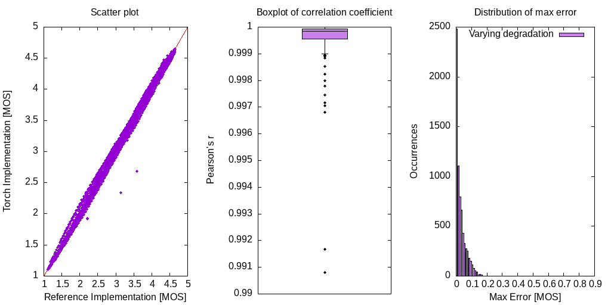

# Loss function inspired by the PESQ score

 
 


Implementation of the widely used Perceptual Evaluation of Speech Quality (PESQ) score as a torch loss function. The PESQ loss alone performs not good for noise suppression, instead combine with scale invariant [SDR](https://arxiv.org/abs/1811.02508). For more information see [1],[2].

## Installation

To install the package just run:
```bash
$ pip install torch-pesq
```

## Usage

```python
import torch
from torch_pesq import PesqLoss

pesq = PesqLoss(0.5,
    sample_rate=44100, 
)

mos = pesq.mos(reference, degraded)
loss = pesq(reference, degraded)

print(mos, loss)
loss.backward()
```

## Comparison to reference implementation

The following figures uses samples from the VCTK [1] speech and DEMAND [2] noise dataset with varying mixing factors. They illustrate correlation and maximum error between the reference and torch implementation:



The difference is a result from missing time alignment implementation and a level alignment done with IIR filtering instead of a frequency weighting. They are minor and should not be significant when used as a loss function. There are two outliers which may degrade results and further investigation is needed to find the source of difference.

## Validation improvements when used as loss function

Validation results for fullband noise suppression:
 - Noise estimator: Recurrent [SRU](https://github.com/asappresearch/sru) with soft masking. 8 layers, width of 512 result in ~1586k parameters of the unpruned model.
 - STFT for signal coding: 512 window length, 50% overlap, hamming window
 - Mel filterbank with 32 Mel features

The baseline system uses L1 time domain loss. Combining the PESQ loss function together with scale invariant [SDR](https://arxiv.org/abs/1811.02508) gives improvement of ~0.1MOS for PESQ and slight improvements in speech distortions, as well as a more stable training progression. Horizontal lines indicate the score of noisy speech.


## Relevant references
1. [End-to-End Multi-Task Denoising for joint SDR and PESQ Optimization](https://arxiv.org/abs/1901.09146)
2. [A Deep Learning Loss Function Based on the Perceptual Evaluation of the Speech Quality](https://ieeexplore.ieee.org/document/8468124)
3. [P.862 : Perceptual evaluation of speech quality (PESQ)](https://www.itu.int/rec/T-REC-P.862)
4. [Perceptual evaluation of speech quality (PESQ)-a new method for speech quality assessment of telephone networks and codecs](https://ieeexplore.ieee.org/document/941023)
5. [CSTR VCTK Corpus: English Multi-speaker Corpus for CSTR Voice Cloning Toolkit](https://datashare.ed.ac.uk/handle/10283/2950)
6. [The Diverse Environments Multi-channel Acoustic Noise Database (DEMAND): A database of multichannel environmental noise recordings](https://asa.scitation.org/doi/abs/10.1121/1.4799597)

[1]: https://arxiv.org/abs/1901.09146
[2]: https://ieeexplore.ieee.org/document/8468124
[3]: https://www.itu.int/rec/T-REC-P.862
[4]: https://ieeexplore.ieee.org/document/941023
[5]: https://datashare.ed.ac.uk/handle/10283/2950
[6]: https://asa.scitation.org/doi/abs/10.1121/1.4799597
