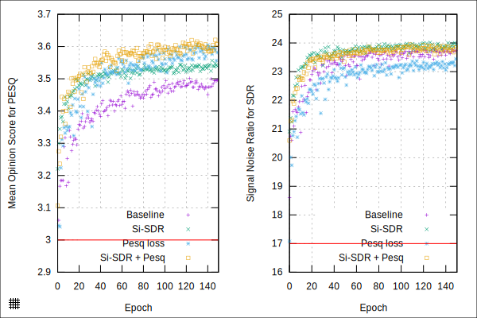

# Loss function inspired by the PESQ score

Implementation of the widely used Perceptual Evaluation of Speech Quality (PESQ) score as a torch loss function. As Delay adjustment and IIR filtering are not implemented, calculated scores may differ from the reference implementation. The PESQ loss alone performs not good for noise suppression, instead combine with scale invariant [SDR](https://arxiv.org/abs/1811.02508). For more information see [1],[2].

## Usage

```python
import torch
from torch_pesq import PesqLoss

loss_fnc = PesqLoss(0.5,
    sample_rate=44100, 
    win_length=1024, hop_length=512,
    nbarks=49,
)
```
## Small comparison of validation score

Validation results for fullband noise suppression:
 - Noise estimator: Recurrent [SRU](https://github.com/asappresearch/sru) with soft masking. 8 layers, width of 512 result in ~1586k parameters of the unpruned model.
 - STFT for signal coding: 512 window length, 50% overlap, hamming window
 - Mel filterbank with 32 Mel features

The baseline system uses L1 time domain loss. Combining the PESQ loss function together with scale invariant [SDR](https://arxiv.org/abs/1811.02508) gives improvement of ~0.1MOS for PESQ and slight improvements in speech distortions, as well as a more stable training progression. Horizontal lines indicate the score of noisy speech.



## Relevant references
1. [End-to-End Multi-Task Denoising for joint SDR and PESQ Optimization](https://arxiv.org/abs/1901.09146)
2. [A Deep Learning Loss Function Based on the Perceptual Evaluation of the Speech Quality](https://ieeexplore.ieee.org/document/8468124)
3. [P.862 : Perceptual evaluation of speech quality (PESQ)](https://www.itu.int/rec/T-REC-P.862)
4. [Perceptual evaluation of speech quality (PESQ)-a new method for speech quality assessment of telephone networks and codecs](https://ieeexplore.ieee.org/document/941023)

[1]: https://arxiv.org/abs/1901.09146
[2]: https://ieeexplore.ieee.org/document/8468124
[3]: https://www.itu.int/rec/T-REC-P.862
[4]: https://ieeexplore.ieee.org/document/941023
